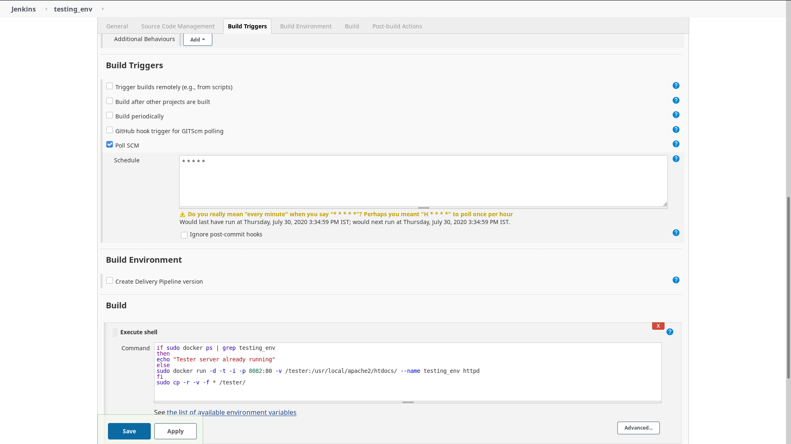
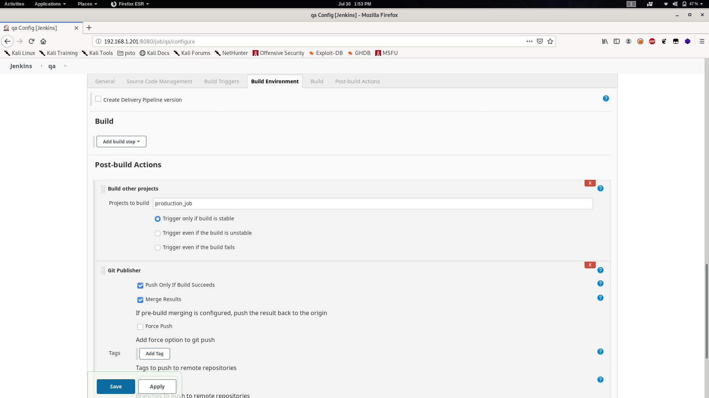
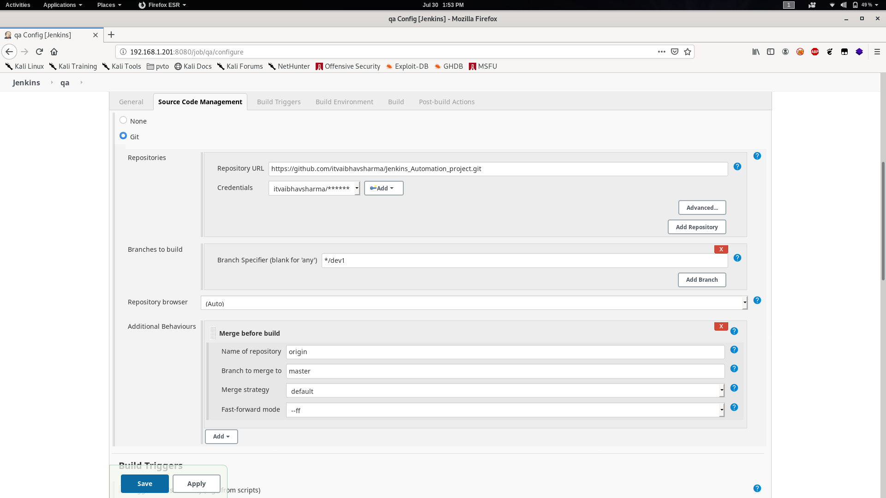
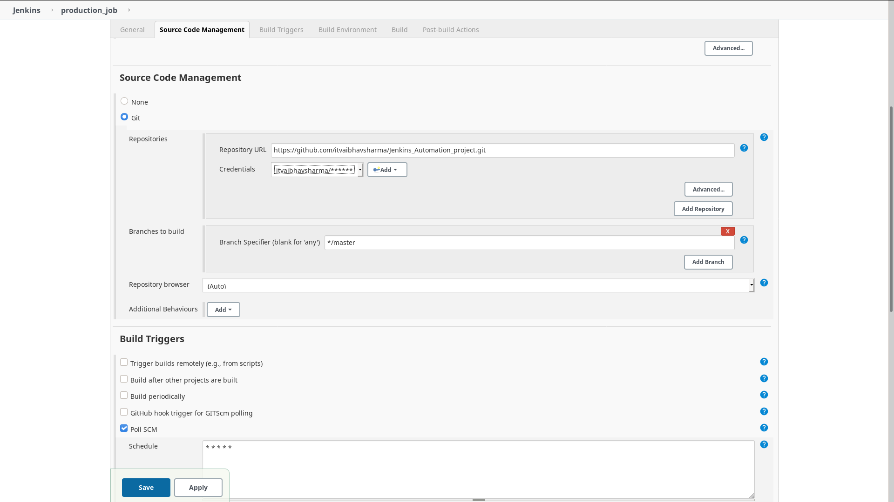
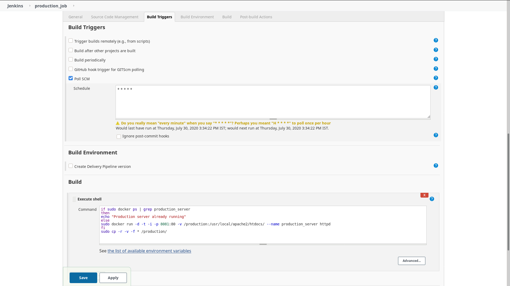

# Jenkins_Automation_project 

AIM: The main aim is to deploy the job in Testing Env initially which is done by testing env 

Testing_env:job1: This job deploys the job in docker and does Nating and exposes the port 80 ->8082 
Hence the developer does the commit in developer branch 

Quality_Assurance_Job:Job2
      The project may fail if Html is not stable lets say PHP it bricks the code running in production env to prevent this we do a quality check and test deploying the code in testing env at first.
      

      
      If the job is stable it merges the developer branch to master branch and triggers the production_env Job
 
Production_job:Job3 Triggered by QA job and deploys the new code from master branch on production Env

video demonstration :
https://www.linkedin.com/posts/itvaibhavsharma_devops-activity-6694915289357840384-_NH3
